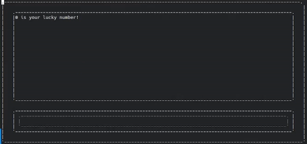

<h1 align="center">
AWDY
</h1>

<div align="center">


[](../../raw/main/LICENSE.txt)

</div>

Are We Done Yet? Spice up your PHP-scripts with progress-bars and more!

## Installation

```bash
composer require robertwesner/awdy @dev
```

## Use

```php
<?php

use RobertWesner\AWDY\AWDY;
use RobertWesner\AWDY\Template\Templates\SimpleTemplate;

require __DIR__ . '/../vendor/autoload.php';

const LIMIT = 1337;
const PROGRESS_AFTER = 100;

// Set up AWDY with a simple template
AWDY::setUp(new SimpleTemplate());

$i = 0;
while (true) {
    if ($i >= LIMIT) {
        break;
    }

    if (($i % 77) === 0) {
        // print to the logging section
        AWDY::printf('%d is your lucky number!' . PHP_EOL, $i);
    }

    $i++;

    if ($i >= LIMIT || ($i % PROGRESS_AFTER) === 0) {
        // update the progress (floating point number 0 to 1)
        AWDY::progress($i / LIMIT);
    }
}
```

## Demo

### Keeping it simple


### Adding some flair



### Always with dynamic size


## Templates

Templates are easy to create, have a look at the [official ones](src/Template/Templates).
